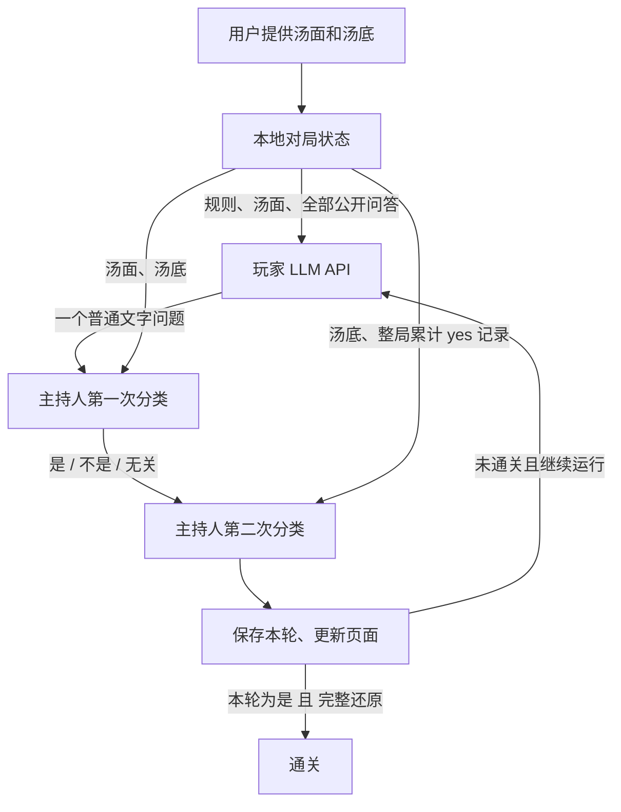

# 上下文、裁判与对局流程

本项目分成原生 HTML / CSS / JavaScript 页面、FastAPI 本地服务、外部玩家 API，以及可替换的主持人后端（Laya / Jev）。网页通过同源接口操作后端，不直接持有到服务商的长期连接。



## 玩家消息

代码：`app/domain.py::player_messages`、`app/player.py`。

每次调用都重新构造 messages，并发送所有已完成轮次。没有额外检索、摘要或长期记忆。

系统提示词：

> 我们正在玩海龟汤，你是玩家。你只知道汤面，裁判知道汤底。
> 根据汤面和此前的问答，每次只问一个问题，裁判会回答“是 / 不是 / 无关”。尽量不要重复已经确认的事情。
> 裁判回答当前问题时不看历史对话。每个问题请说清具体人物和事件，让它结合汤面即可独立理解，避免“所以是这样吗”等依赖上一轮的表达。
> 如果你认为已经猜出了汤底，就用一个完整的问题说出你猜到的经过和原因，请裁判确认。

消息顺序：

```text
system: 游戏规则
user: 汤面 + 最多轮数 + 请开始
assistant: 第 1 轮提问
user: 裁判：是
assistant: 第 2 轮提问
user: 裁判：不是
...
user: 当前第 N/M 轮。请问下一个问题。
```

第一轮没有最后的轮数提醒。后续轮次保留最初的汤面和规则。

出站请求正文只有 `model`、`messages`、`stream: false`。没有 `max_tokens`、`response_format`、`temperature` 或思考模式覆盖。API Key 放在 Authorization 请求头，不放在消息中。

正式回答从 `choices[0].message.content` 读取，可接受字符串或文本块。单独的 reasoning 字段不会被当成问题，也不会回传到下一次上下文。模型返回普通文字即可；空回答会报错。旧版本的 `{"kind":"question|solution","text":"..."}` 输出仍可读取，但提示词不再要求它。

## 主持人第一次判断：回答问题

代码：`app/judging.py::DecisionJudge.evaluate`。两个后端共享这段游戏逻辑。

状态：

```json
{
  "story": "完整汤面",
  "truth": "完整汤底",
  "question": "当前玩家问题"
}
```

指令原文：

```text
Based only on the story truth, answer the player's current yes/no question.
Read negations carefully. Undocumented irrelevant details are unknown.
```

| 选项 | 含义 |
|---|---|
| yes | 是。问题中的命题被汤底支持。 |
| no | 不是。命题与汤底矛盾。 |
| irrelevant | 无关。细节无关，或故事没有说明。 |

单题输入不包含历史。玩家提示词要求问题结合汤面即可独立理解；上轮的概率和阶段也不进入推理输入。

## 主持人第二次判断：对照汤底

状态：

```json
{
  "premise": "整局累计被回答为是的问题原文及肯定回答；当前问题只有被肯定后才加入",
  "hypothesis": "完整汤底"
}
```

汤面不在这次状态里单独提供。指令原文：

```text
The premise contains only propositions confirmed by affirmative answers. Preserve negations in the original questions. Do these confirmed propositions jointly reconstruct the hypothesis's core events, cause and outcome? Being true or consistent is insufficient. Do not fill gaps using the hypothesis.
```

按语义关系做分类：

| 选项 | 描述 |
|---|---|
| complete | entailment: confirmed propositions jointly cover the core events, cause and outcome |
| partial | neutral: part of the core explanation is still missing |
| conflict | contradiction: the confirmed propositions conflict with the story truth |

这一步只比较已被肯定的原始命题与完整汤底，排除 no、irrelevant 和尚未确认的猜测。不改写问题、不删除否定词、不把 no 自动翻转成事实。要求共同覆盖核心经过和原因，不只判断每条内容是否正确。没有肯定记录时直接显示“尚无肯定线索”，不请求进度推理，也不伪造概率。

从整局记录筛选肯定记录，并按原始顺序全部提供，不再使用最近 8 轮窗口。当前问题只有被肯定后才加入。Laya 放不下完整输入时明确报错，不删减早期线索；后端保留原有历史和 pending 问题，切换支持更长输入的主持人后可以重试，无需重复调用玩家。Jev 不使用 Laya 的分词器或 token 上限。

进度记录使用 `evidence_source=affirmed_questions`，并保存 `confirmed_count` 与 `confirmed_rounds`；页面显示累计肯定记录数。旧记录保留原来的阶段与窗口描述，不重写历史判决。

## 分类与通关

Laya 是编码器和决策头，给候选选项打分；它不逐字生成裁判回答。推理序列由上游 `build_sequence` 构造：

```text
[CLS] 分类类型与判断指令 [SEP]
[MASK] 选项 1 [MASK] 选项 2 [MASK] 选项 3 [SEP]
JSON 状态 [SEP]
```

选项分数使用检查点配置的温度进行 softmax，取最高概率的选项。Jev 则直接读取原生响应的 `answers.decision.choice`、`probabilities` 和可选的 `confidence`。两次判断顺序执行，第二次只有在第一次给出肯定结果时才加入当前问题。无肯定记录时跳过第二次请求。程序没有额外的通关置信度门槛。

当前普通问题流程的通关条件为：

```text
本轮 answer == yes AND 本轮 stage == complete
```

内部保留旧版 solution 动作的读取：先判断当前解答是否正确，仅被判为 correct 的解答可以与其他肯定记录一起进入通关判断。尚不完整或矛盾的解答不会绕过筛选。新流程直接使用普通问题。

## 状态与重试

代码：`app/server.py::Controller.run`。

- 后端每轮先准备所选主持人，再请求玩家，避免缺失权重时先花费 API 调用。
- 玩家问题写入 pending 后才运行裁判。裁判失败时，重试会沿用这个问题。
- 本轮判断完成后保存记录，再决定通关、轮数用尽、暂停或继续。
- 暂停等待已经发起的轮次结束；页面刷新不会取消后端任务。
- 记录恢复时，未结束的对局以暂停状态恢复。密钥不会从磁盘恢复。
- 暂停后可以更换主持人，下一轮使用新选择；每轮单独记录主持人名称、类型和配置的模型 ID。运行中的轮次禁止更换主持人。

## 文件与数据

| 位置 | 用途 | 是否纳入源码仓库 |
|---|---|---|
| `app/` | 提示词、API、分类、状态机 | 是 |
| `app/vendor/` | 原样引用的上游代码、许可证 | 是 |
| `static/` | 原生网页 | 是 |
| `scripts/` | 下载与真实模型检查 | 是 |
| `tests/` | 无密钥、无权重的自动测试 | 是 |
| `models/` | 独立下载的权重和分词器 | 否 |
| `.cache/` | 本地分词器兼容副本、工具缓存 | 否 |
| `.data/` | 对局及非密钥配置 | 否 |

Jev 的状态通过原生 System One HTTP 接口发送到配置的地址，含完整汤底；玩家消息仍严格排除汤底。API 密钥只存在服务内存；导出与记录包含汤底，但没有密钥。模板和日志的展示使用纯文本。服务只绑定 loopback，并检查写请求的 Origin 与 JSON Content-Type。它没有用户认证，不能作为多用户公网服务直接使用。

## 已知限制

- Laya 输入较短，整局肯定记录可能超限；此时暂停提示，而非丢弃旧线索。
- 只用肯定记录会舍弃 no 回答中的排除信息；原始疑问中的否定与指代也可能影响判断。
- 早期被主持人错误肯定的内容仍会进入累计证据；模型判决并非事实保证。
- 模型没有针对本项目的海龟汤数据训练或校准；概率不是准确率。
- 玩家 API 没有在应用侧截断历史；整局过长时仍可能达到服务商自己的上下文限制。
- 改变游戏提示词、候选描述或 checkpoint，都会改变判决，不能只凭自动测试通过就断言准确率改善。


## 扩展主持人后端

共享游戏流程位于 `app/judging.py`。后端继承 `DecisionJudge`，实现 `load()`、`status()` 和 `predict(state, instructions, criteria)`，并提供 `lock` 与 `device`。有本地 token 预算的后端可以覆盖 `fits()`。

`app/judge.py` 负责本地 Laya；`app/jev.py` 负责 TypeSafe 原生协议。新增后端时扩展 `JudgeConfig.provider`、工厂和网页选择项，并添加协议、失败重试和密钥隔离测试。不要让新后端把汤底混入玩家消息。
